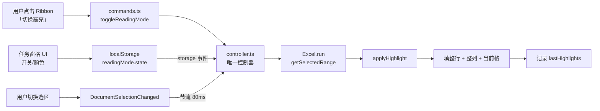

# 阅读模式高亮 (Excel Reading Highlight)

一款仿 WPS「阅读模式」的 Excel 加载项（Office Add-in）。选中任意单元格时，自动高亮其所在**行表头**（A 列对应单元格）和**列表头**（第 1 行对应单元格），帮助你在一张大表里迅速定位行列。

> ✨ 类似 WPS 的阅读模式效果，但在原生 Excel 里运行。

---

## 1. 项目简介

| 项目信息 | 值 |
| --- | --- |
| 项目名 | `excel-reading-highlight` |
| 版本 | `0.0.1` |
| 类型 | Office Add-in (Task Pane App) |
| 支持宿主 | Microsoft Excel (Desktop) |
| 权限 | `ReadWriteDocument` |
| License | MIT |

---

## 2. 核心功能

- ✅ **选中即高亮**：移动选中单元格时，所处的**行表头**与**列表头**自动染色。
- ✅ **一键开关**：通过 Ribbon 上的「切换高亮」按钮或任务窗格里的开关，自由启用/停用。
- ✅ **自定义颜色**：行表头、列表头颜色可在任务窗格中独立配置（默认 `#E3F2FD` / `#E8F5E9`）。
- ✅ **节流优化**：`onSelectionChanged` 事件使用 80ms 节流策略，避免快速移动时高频 Excel API 调用导致卡顿。
- ✅ **批量清理**：切换工作表或多选区域时，自动清掉旧高亮，不会污染表格样式。
- ✅ **零侵入**：仅修改目标单元格的 `format.fill.color`，不改动值、不改公式、不改格式。

---

## 3. 效果展示

> 选中 `C5` 时，自动给 `A5`（行表头）填蓝、`C1`（列表头）填绿：

```
       A        B        C        D
  ┌────────┬────────┬────────┬────────┐
1 │  姓名  │  部门  │▓▓入职日▓▓│  职级  │   ← C1 被填绿色
  ├────────┼────────┼────────┼────────┤
2 │  张三  │  产品  │ 2024-01 │  P5   │
3 │  李四  │  设计  │ 2024-02 │  P5   │
4 │  王五  │  工程  │ 2024-03 │  P6   │
5 │▓▓赵六▓▓│  市场  │ 2024-04 │  P5   │   ← A5 被填蓝色（选中 C5）
  └────────┴────────┴────────┴────────┘
```

图例：`▓▓` = 行表头高亮（默认浅蓝），列表头高亮（默认浅绿）。

---

## 4. 安装与加载

本加载项采用 **侧载 (sideload)** 方式加载到 Excel，无需发布到 AppSource。

### 4.1 前置条件

- Microsoft 365 (Excel for Windows 或 macOS)
- Node.js ≥ 16（推荐 LTS 18+）
- npm ≥ 8

### 4.2 安装开发证书（仅首次）

加载项运行在 `https://localhost:3000`，需要本机信任 Office 加载项的开发证书：

```bash
npm run signin          # 登录 Microsoft 365 账号（按需）
npx office-addin-dev-certs install
```

### 4.3 启动调试服务器

```bash
npm install
npm start
```

`npm start` 等价于 `office-addin-debugging start manifest.xml`，它会：

1. 自动构建并启动 `webpack-dev-server`（端口 3000）。
2. 弹出 Excel（Windows）或提示在 Mac 上手动打开。
3. 在 Excel 里以临时加载项形式挂载本插件。

### 4.4 在 Excel 中加载

**Windows**：上述步骤会自动打开 Excel 并加载，**无需手动操作**。

**macOS**：

1. 打开 Excel → 顶部菜单 **插入** → **我的加载项** → **管理我的加载项**。
2. 选择 **共享文件夹** 标签页，把 `manifest.xml` 拖进 Excel 加载项对话框即可。
3. 之后每次运行 `npm start`，加载项会自动运行。

> 提示：Mac 下若 dev server 启动后 Excel 未自动加载，可重启 Excel 后再试。

---

## 5. 使用说明

### 5.1 打开/关闭阅读模式

两种方式（二选一）：

- **Ribbon 按钮**：功能区出现「**阅读模式**」自定义选项卡 → 点击「**切换高亮**」。
- **任务窗格**：点击「**高亮设置**」按钮打开右侧任务窗格，点击「**高亮开关**」。

### 5.2 调整颜色

任务窗格内提供两个颜色选择器：

| 设置项 | 默认值 | 说明 |
| --- | --- | --- |
| 行表头颜色 | `#E3F2FD` | A 列中被高亮单元格的颜色 |
| 列表头颜色 | `#E8F5E9` | 第 1 行中被高亮单元格的颜色 |

修改颜色会**立即生效**（如果阅读模式处于激活状态，会自动用新颜色重新高亮）。

### 5.3 注意事项

- 插件使用 `ReadWriteDocument` 权限，会向工作簿写入单元格填充色。如果工作簿被设置为「禁止更改」，高亮将失败，控制台会输出错误。
- 高亮只发生在**活动工作表的单单元格**选中时。多选 / 合并区域会被忽略并清掉旧高亮。
- 关闭阅读模式会自动清除所有高亮（只清除被本插件高亮的单元格）。

---

## 6. 开发指南

### 6.1 常用脚本

| 命令 | 说明 |
| --- | --- |
| `npm install` | 安装依赖 |
| `npm start` | 一键启动（构建 + 调试） |
| `npm run dev-server` | 仅启动 webpack-dev-server，不加载到 Excel |
| `npm run build` | 生产构建（webpack --mode production） |
| `npm run build:dev` | 开发构建（带 sourcemap） |
| `npm run watch` | 监听文件变更并增量构建 |
| `npm run lint` | 检查代码规范（office-addin-lint） |
| `npm run lint:fix` | 自动修复代码规范问题 |
| `npm run prettier` | 运行 Prettier 格式化 |
| `npm run validate` | 校验 `manifest.xml` 是否符合 Office Add-in 规范 |
| `npm run stop` | 停止调试服务器并关闭 Excel |
| `npm run signin` / `signout` | Microsoft 365 账号登录/登出（调试用） |

### 6.2 目录结构

```
excel-reading-highlight/
├── manifest.xml                  # Office Add-in 清单（声明 UI、权限、入口）
├── package.json                  # 依赖与脚本
├── tsconfig.json                 # TS 编译配置
├── webpack.config.js             # 构建配置（多入口：taskpane + commands）
├── babel.config.json             # Babel 配置（用于 TypeScript 转译）
├── vitest.config.ts              # 单元测试配置
├── .husky/pre-commit             # 提交前 lint + validate + build
├── assets/                       # 图标资源（16/32/64/80，统一 SVG 风格）
├── scripts/
│   ├── clear-wef.js              # 清 Mac Excel WEF 缓存（npm run clear:wef）
│   └── start.sh                  # 一键启动（npm run start:dev）
└── src/
    ├── commands/
    │   ├── commands.html         # Commands 入口 HTML（Ribbon ExecuteFunction 运行环境）
    │   ├── commands.ts           # Ribbon 按钮的 Action 注册 + 启动时 ensureEnabled
    │   ├── commands.excel.ts     # toggleReadingMode/clearAll/ensureEnabled 薄包装
    │   └── controller.ts         # 唯一控制器:状态 + 选区监听 + Excel 操作
    ├── taskpane/
    │   ├── taskpane.html         # 任务窗格 UI（开关 + 颜色选择器 + 全 sheet 清高亮）
    │   ├── taskpane.css          # 任务窗格样式
    │   └── taskpane.ts           # 任务窗格入口 + UI ↔ controller 桥接(localStorage)
    └── shared/
        ├── ReadingModeCore.ts    # 纯函数 + Excel 操作(被 controller 调用)
        └── ReadingModeCore.test.ts # 纯函数单测(vitest)
```

### 6.3 构建配置要点

- **多入口**：`webpack.config.js` 把 `taskpane` 和 `commands` 分别打包成两个 HTML 入口（`taskpane.html` / `commands.html`），对应 `manifest.xml` 里的 `Taskpane.Url` 与 `Commands.Url`。
- **TypeScript**：通过 `babel-loader` + `@babel/preset-typescript` 转译，类型检查需要单独跑 `tsc`（当前未集成到 npm scripts）。
- **静态资源**：`copy-webpack-plugin` 把 `assets/` 复制到 `dist/assets/`，通过 `https://localhost:3000/assets/...` 访问。

---

## 7. 架构与设计要点

### 7.1 整体架构



### 7.2 Ribbon ↔ Taskpane 通信

Office Add-in 中，Ribbon 上的按钮 Action 运行在独立的 `commands.html` 上下文（**没有 DOM、没有 UI**），任务窗格运行在 `taskpane.html` 上下文。两个 iframe 同源,通过 **localStorage + `storage` 事件** 单向同步:

- **taskpane 改色 / 开关**: `saveState()` 写入 `localStorage["readingMode.state"]`,controller 端的 storage listener 触发 `applyCurrentSelection()` 重涂。
- **taskpane 触发命令**(如"全 sheet 清高亮"): 写 `localStorage["readingMode.command"] = {cmd:"clearAll",ts:...}`,controller 收到 storage 事件后执行对应方法,然后清掉 command key。
- **controller → taskpane**: 状态变化时写同一份 `readingMode.state`,taskpane 的 storage listener 同步 UI(开关 aria-checked、颜色选择器 value、状态文案)。

> 这种"localStorage 作为单一事实源 + storage 事件做广播"的模式比 `messageParent` 简单,且不要求 taskpane 始终打开。
>
> ⚠️ **`messageParent` 不能再用** — 那是 `Office.context.ui.messageParent`,只对 **Dialog API**(对话框)有效,不是 iframe 之间通信的工具。taskpane ↔ commands.html 之间的所有通知一律走 `storage` 事件,不要被旧 Office Add-in 示例里的范式误导。

### 7.3 ReadingModeController 单例

`controller` 在 `commands.ts` 入口创建**全局单例**(`export const controller = new ReadingModeController()`),在 commands.html 上下文常驻:

- `_state.enabled` / `_state.crossColor` / `_state.cellColor`:从 `localStorage["readingMode.state"]` 加载,所有改动写回。
- `_lastHighlights`:已高亮记录(`LastHighlight[]`),key 是 `sheetName`,**不删旧 sheet 条目**,跨 sheet 切换时只清旧 sheet 视觉 + 恢复新 sheet 存储(见 7.5)。
- `_lastSheetName`:记录当前 sheet,用于检测 sheet 切换。
- `_registered`:`DocumentSelectionChanged` handler 单例标志,避免重复注册。
- `_pendingTimer`:80ms 节流的 pending 句柄,关闭模式时清掉。

### 7.4 节流策略

`onSelectionChanged` 在用户拖选时可能 1ms 触发数次,直接执行 `Excel.run` 会非常卡。`_throttle(fn)` 做了两层处理:

- 如果距离上次调用 ≥ 80ms → **立即执行**。
- 否则 → 设置 `setTimeout` 在 80ms 后执行,并清掉之前的 pending timer。

### 7.5 工作表切换处理

切换 sheet 时,`_doHighlight` 读取当前 worksheet 名称,与 `_lastSheetName` 对比:

- 若不一致 → **只清旧 sheet 的视觉**(不删 `_lastHighlights` 里的旧条目),然后:
  - 如果新 sheet 在存储里有 lastHighlight → 直接恢复,不让当前选区覆盖
  - 如果没有 → 走 phase2 读选区 + 算 plan + 涂新
- 若一致 → 复用旧记录,直接走 phase2。

这样**回到之前访问过的 sheet,之前高亮自动恢复**,不会被新的选区覆盖。

### 7.6 高亮清理

仅清除**被本插件记录过的单元格**（`format.fill.reset()`），不会误伤用户自定义的填充色。

---

## 8. 常见问题 (FAQ)

### Q1: 启动后 Ribbon 上看不到「阅读模式」选项卡？

**A**: 检查 `manifest.xml` 是否被正确加载。Windows 下重新执行 `npm start`；macOS 下需要重新通过「我的加载项」挂载一遍。另外确认 Excel 是 Microsoft 365 版本（Office 2019 永久版可能不支持）。

### Q2: 点击按钮没反应 / 控制台报错？

**A**: 打开 Excel 的开发人员工具（macOS: 菜单 → 开发工具 → Web 检查器），查看 Console 报错。常见原因：

- 端口 3000 被占用 → 修改 `package.json` 的 `dev_server_port` 和 `manifest.xml` 里的 URL。
- 开发证书未安装 → 重新执行 `npx office-addin-dev-certs install`。

### Q3: 修改颜色后没立即生效？

**A**: 请确认阅读模式已开启（状态显示「已激活」）。如果仍未生效，关闭后重新开启即可——这是因为某些 Excel 版本对 `format.fill.color` 的赋值有缓存。

### Q4: 在受保护的工作表上能用吗？

**A**: 不行。本插件使用 `ReadWriteDocument` 权限，需要工作表允许格式修改。遇到保护工作表时会跳过染色并输出 console warning。

---

## 9. 已知限制

- ❌ **不支持 Office 2019 及以下永久版**：仅 Microsoft 365 / Office 2021+ 支持最新 Office.js API。
- ❌ **不支持真多选区域**：选中 M×N（多行多列）时不涂,旧高亮保留;1×N 整行会涂该行,N×1 整列会涂该列(行为符合预期)。
- ❌ **合并单元格高亮位置偏差**：插件基于 `getSelectedRange()` 返回的原始单元格地址涂色,合并单元格的视觉位置可能与高亮位置不一致(目前按设计文档:会在后续版本修)。
- ❌ **不支持撤销合并**：高亮不属于用户的可撤销操作（不要用 Ctrl+Z 撤销插件高亮）。
- ❌ **样式面板可能混淆**：点击到被高亮的单元格时，「填充色」会显示为插件设置的颜色，**不是用户原格式**。
- ❌ **大型工作表性能**：超过 10000 行的表，切换 sheet 时清理操作可能短暂卡顿。
- ⚠️ **`office-addin-manifest validate` 对 `CustomTab/Label` 报错**：该 validator 自带的 schema 对 `CustomTab` 子元素 `Label` 的校验自相矛盾(同一个 manifest 一会儿说"Label 非法",一会儿说"Label 缺失")。这是 validator 的 bug,不是 manifest 的问题——Excel 实际加载正常。pre-commit hook 因此**没有**跑 manifest 验证;改 manifest 后建议手动 `office-addin-debugging start manifest.xml` 加载一次确认。

---

## 10. License

[MIT](./LICENSE)

---

> 💡 **二次开发提示**：核心逻辑全部在 [`controller.ts`](./src/commands/controller.ts) 一个文件里(常驻 commands.html context),扩展功能(例如:支持多选、按条件高亮、撤销集成)主要修改这一个文件即可。任务窗格只做 UI 桥接,核心 Excel 操作不会出现在那里。